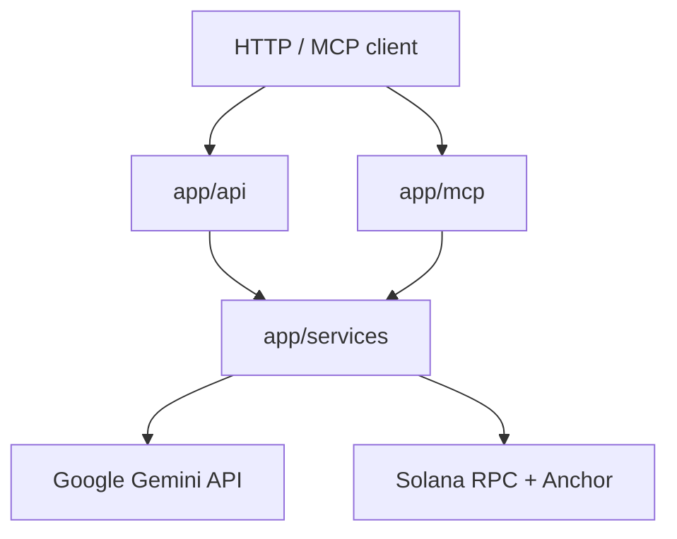

# System Patterns

## Архитектура (после PLAN + CREATIVE)

Клиенты (HTTP или MCP) попадают в **транспортный слой**; бизнес-логика только в **`app/services`**; контракты — **`app/schemas`**.

Node.js в репозитории — опционально, не часть критического пути спринта.

## Паттерны

- **Layered architecture:** `api` и `mcp` не содержат тяжёлой логики — только валидация/вызов сервисов.
- **Adapter для LLM:** `GeminiService` инкапсулирует **`google-genai`**, системную инструкцию и **controlled generation** (response schema → `decision`, `reasoning`, `risk_level` 0–100).
- **Chain writer:** `SolanaService` — anchorpy `Program`, RPC через solana-py `Client`, `Wallet` из `SOLANA_PRIVATE_KEY` / keypair path.
- **Configuration:** `app/config.py` (Pydantic Settings), секреты только из env.

## Антипаттерны

- Дублирование логики verify/register в роутерах и MCP tools.
- Хранение keypair в git.
- Прямой импорт SDK в роуты минуя сервисы.

## MCP (день 3)

- Инструменты **`verify_intent`**, **`register_agent`**, **`get_status`**: первые два пробрасывают данные в **`GeminiService`** (и при необходимости в `SolanaService`); `get_status` — только chain.
